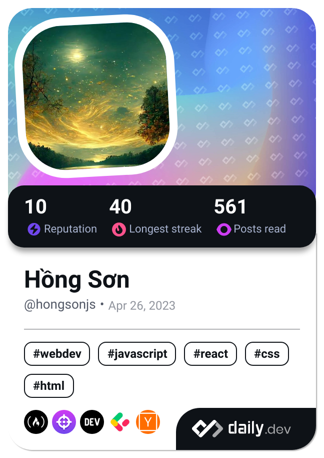

<h1 align="center">Greetings 🙋‍♂️, I'm SonZinDev</h1>
<h3 align="center">

> I'm a FE Developer from VN.

- 🌱 I’m currently learning **React**
- 💬 Ask me about **Anything**, I am happy to help :smile:
- 🧗 I try to: **Go beyond and push the bounds**
- ⚡ I **Love** connecting with different people :raised_hands:
- 📫 How to reach me: **hongson.js@gmail.com**

